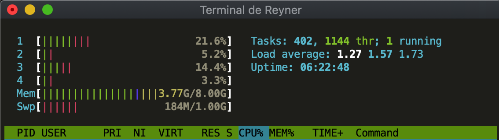

# iTerminal Monokai
Implementacion del esquema de colores Monokai para la Terminal de OS X e iTerm

## Como instalar

1. Clonar el repositorios `git clone git://github.com/reynercrc/iterminal-monokai.git`
2. Abra el archivo `Monokai.terminal` o `Monokai.itermcolors` y a hacer para instalar.
3. (Opcional) Opcionalmente abrir las preferencias de Terminal o iTerm para ajustes adicionales.

## Licencia
Este proyecto es brindado con licencia MIT [license](LICENSE).

## Creditos
El esquema de colores Monokai fue creado por Wimer Hazenberg, http://monokai.nl